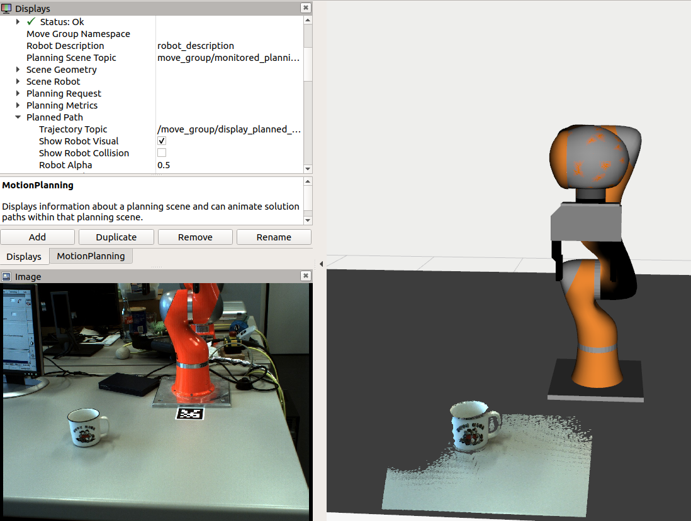

# TAMS KUKA LWR

|  |  |
|---------------------------|----------------------------------|
| Kuka LWR                  | Perception                       |

## Introduction
- Our setup uses the FRI (fast-research-interface) for real-time communication with the arm controller at 100Hz+.
- The ROS node is an improved version of the `FRILibrary` code from Torsten Kröger and the `Reflexxes-TypeII` real-time motion generation, providing joint-position goals, velocity goals, trajectory execution, and both joint and Cartesian compliance modes. See the `ros_fri` package for details.
- Startup of the robot is a bit fiddly, make sure to select the correct tool and coordinate base system at startup, and see below for detailed instructions and tips [doc here](doc/kuka_quick_start_guide/quick_start_kuka.md).
- Once the KUKA controller detects a motion anomaly it basically locks up. Restart the robot and the ROS nodes.

## ROS workspace setup
- In your workspace
```bash
git clone https://github.com/lianghongzhuo/reflexxes_type2.git
git clone https://github.com/lianghongzhuo/frilibrary.git
git clone https://github.com/TAMS-Group/tams_apriltags.git
git clone git@git.crossmodal-learning.org:TAMS/tams_lwr.git
```

or use `rosinstall` file:
```bash
cd src
wget https://raw.githubusercontent.com/TAMS-Group/rosinstalls/master/melodic-tams-lwr.rosinstall
mv melodic-tams-lwr.rosinstall .rosinstall
wstoll update
```
- Build your workspace with
`catkin build`

## Robot setup
- see [doc here](doc/kuka_quick_start_guide/quick_start_kuka.md) for a step to step instruction.

## Run robot with ROS
- see [doc here](doc/run_lwr_with_ros.md) for a step to step instruction.

## PDF documentations
- All PDF documentations are at: https://git.crossmodal-learning.org/TAMS/tams_lwr_doc
