# Quick start for KUKA LWR

## switch on KUKA
- turn the right upper switch to straight position
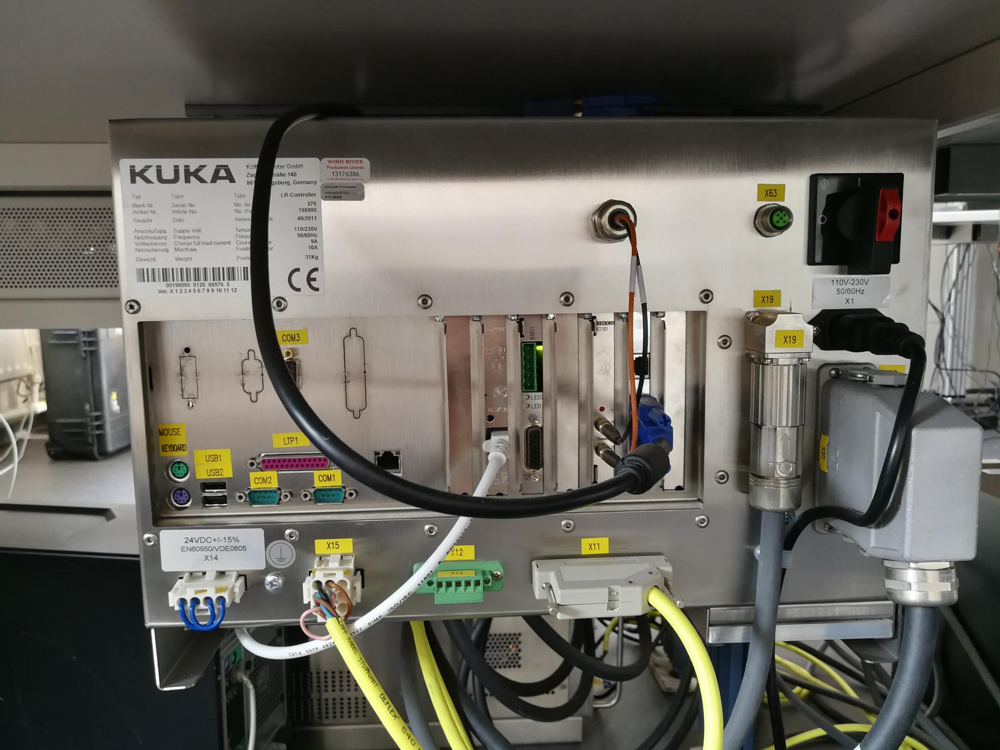
- wait for booting (around 4 min), you will see below screen
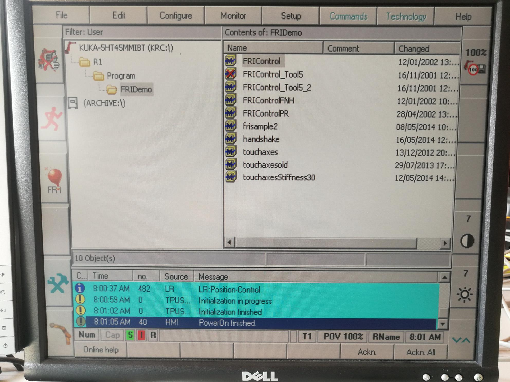

## setup needed for each booting
- setup tool and base
    - press `configure`
    - press `6 set too/base`
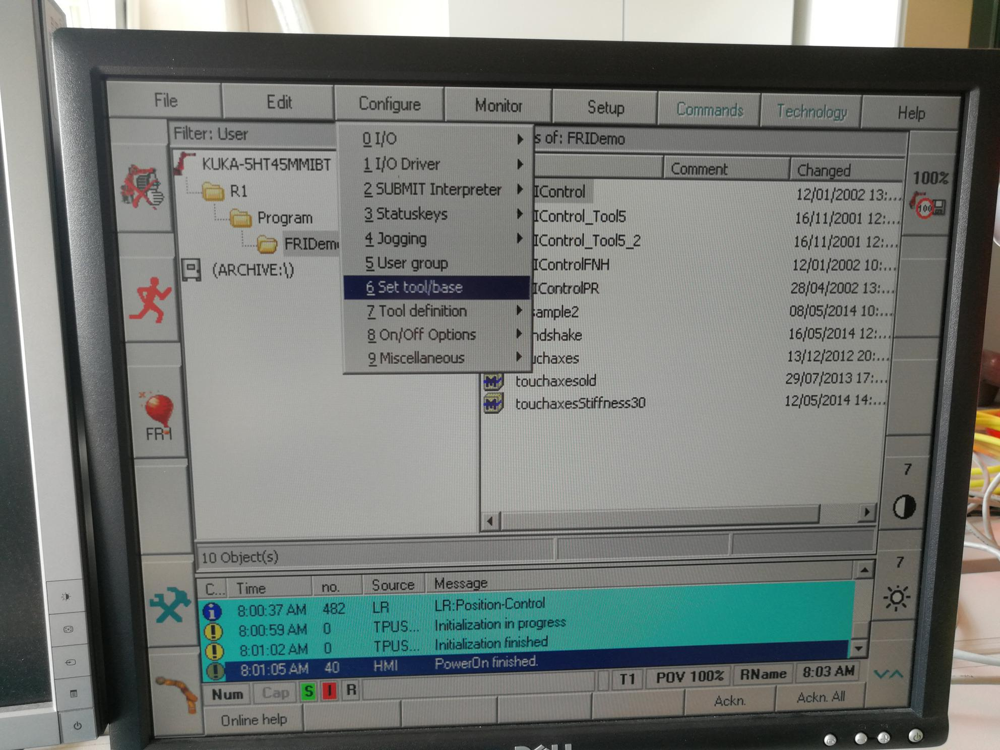
    - you will see
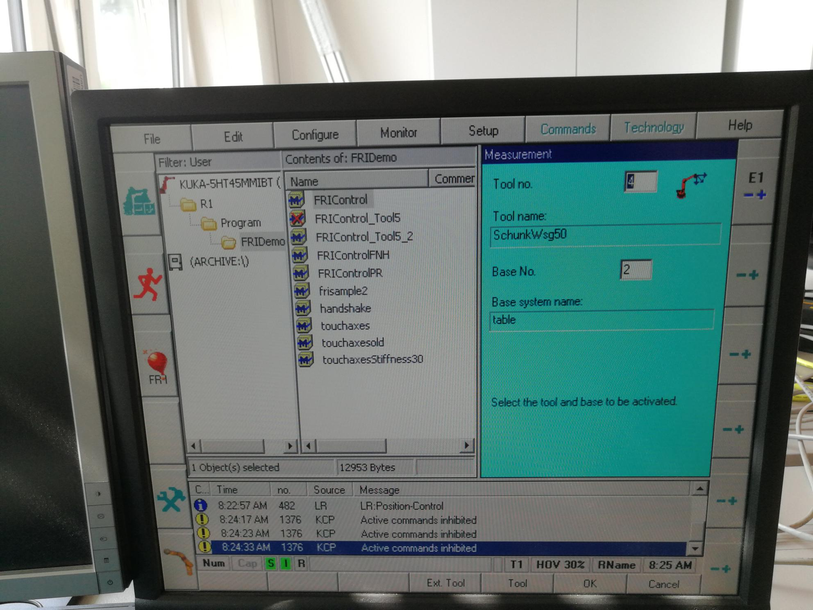
    - then set `Tool no.` to 4 which is `Schunk Wsg50`
    - set `Base No.` to 2 which is `table`

## enable the robot
- in KUKAControlPanel (KCP), press the blue button at the left most column, second row, this bottom is for switch witch part of the KCP to enable. press several times utill you see `Ackn. All` in the right bottom of the KCP
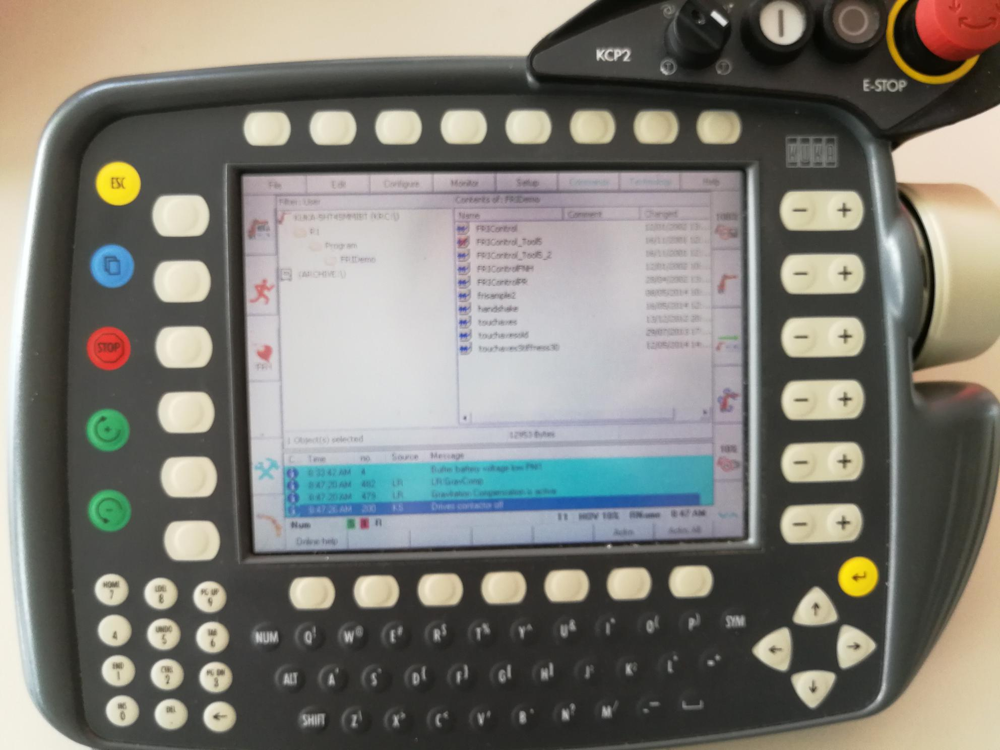

- then you press the button `Ackn. All` to enable the robot
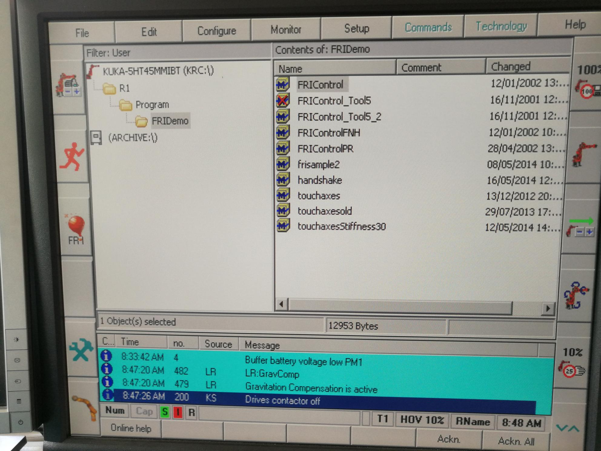

## control robot using position control / teach mode
- press here:
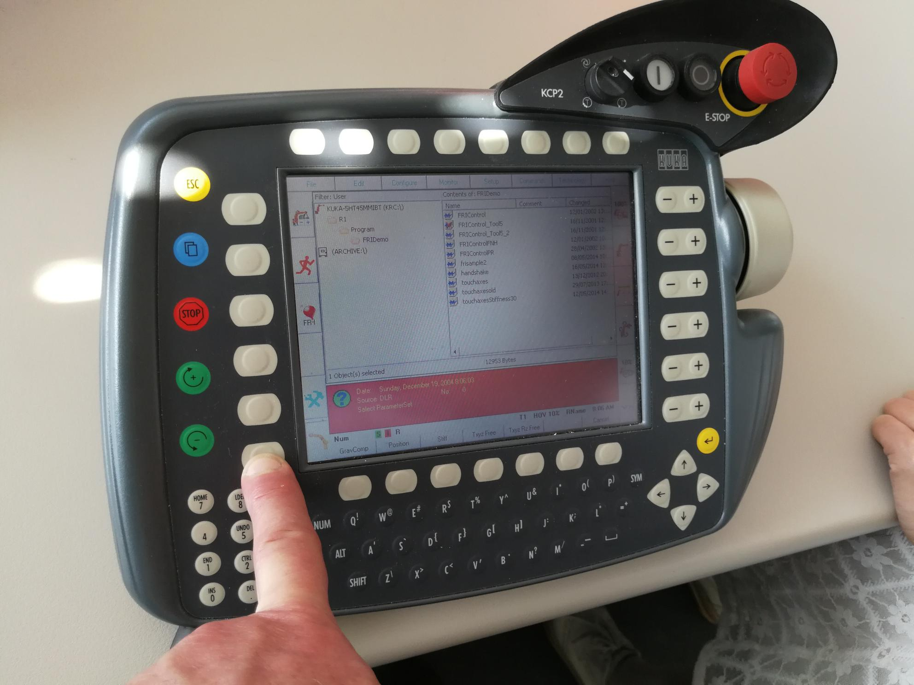
- you will see (note the below two red circle):
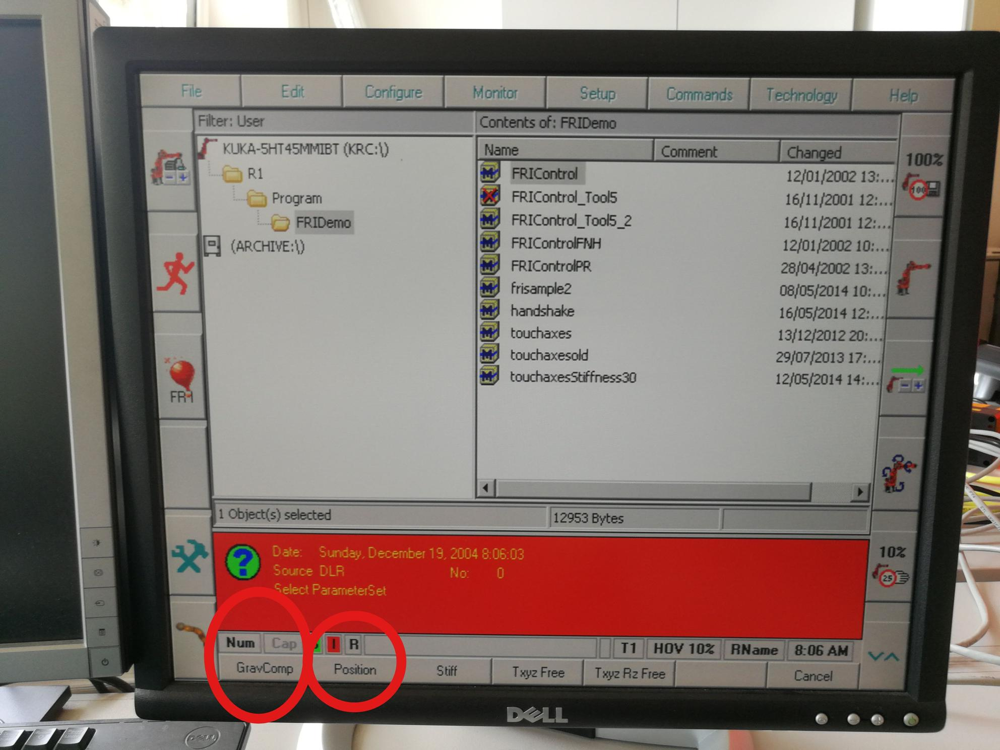
  - for teach mode: press `GravComp`
  - for position control: press `Position`

- then press the white `enable` button at the back of KCP to control the robot manually

- Note for position control
  - press this button to change mode: (note the red circle)
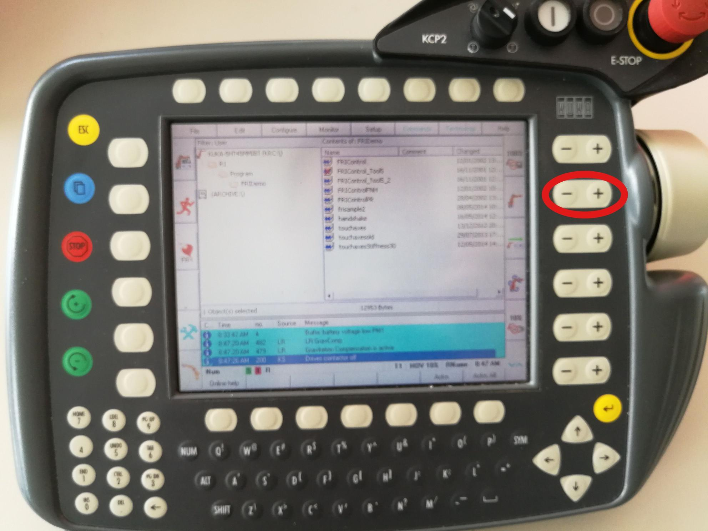
  - available choices:
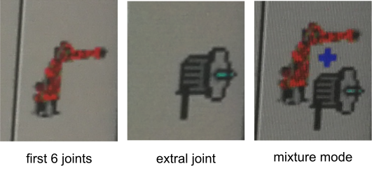
  - the left mode will control J1 to J6
  - the middle mode will control E1

## shutdown the robot
  - just turn the red button to horizontal position
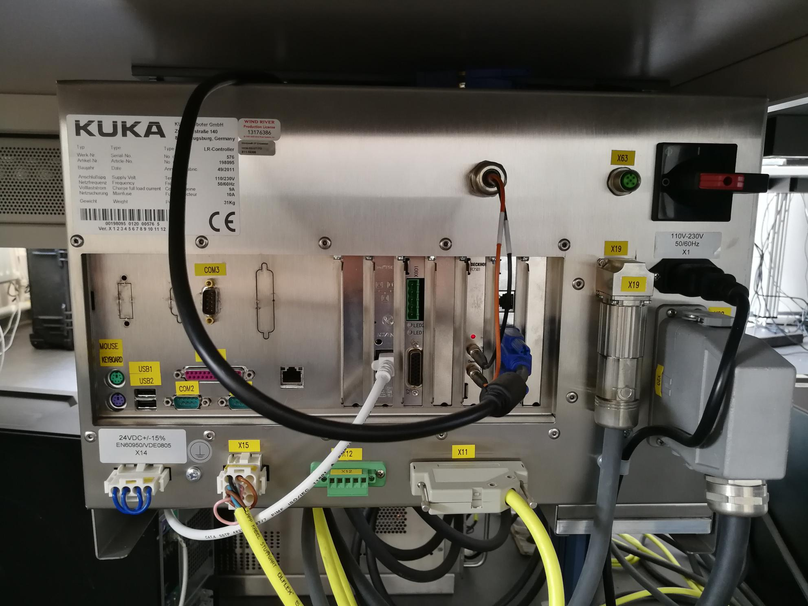
  - put the KCP back to the wall
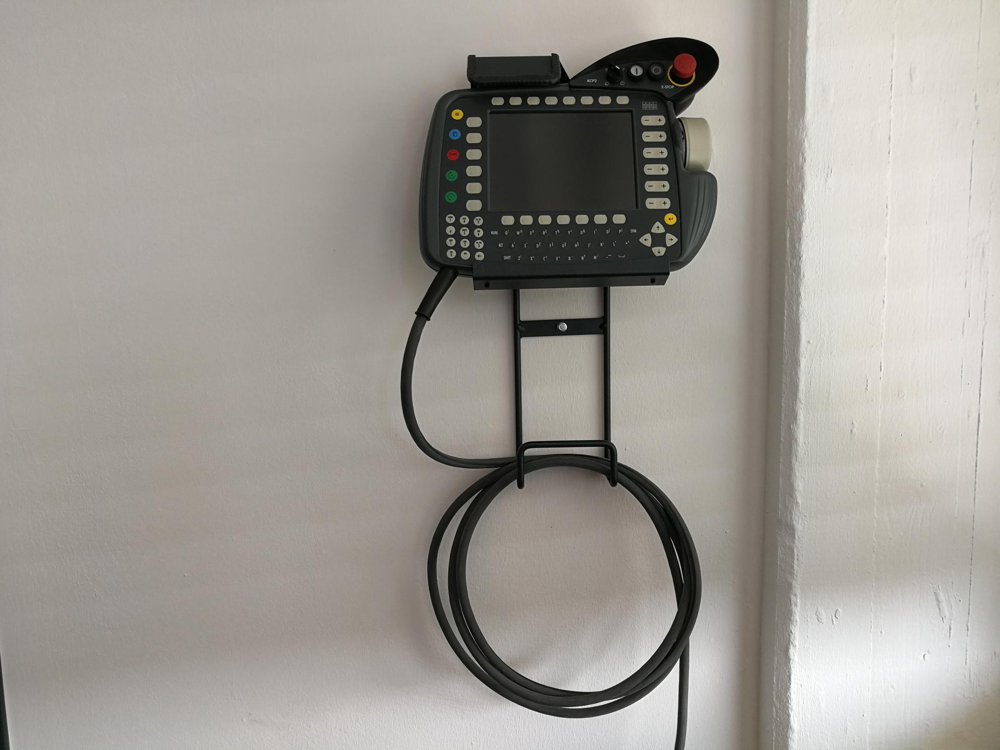
